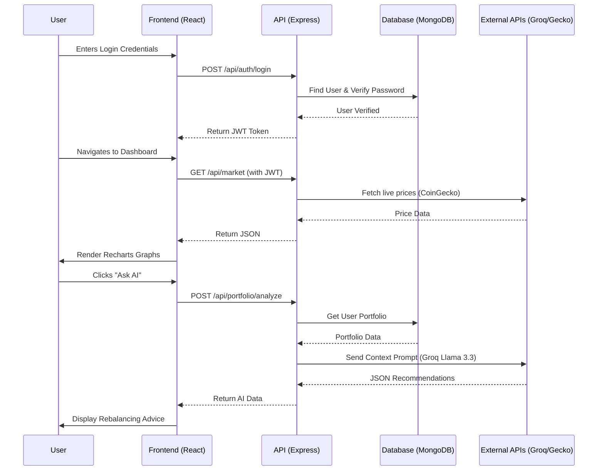

# 🎓 Crypto Market Intelligence Masterclass - Lesson 4

In this lesson, we will cover **Phase 7 (APIs)** and **Phase 9 (Visual Flowcharts)**.

---

## 🔌 PHASE 7 – APIs

The Express backend exposes a RESTful API. Let's look at one of the most critical endpoints in detail: the Portfolio Analysis endpoint.

### API Endpoint Deep Dive: AI Portfolio Analysis

- **Endpoint:** `/api/portfolio/analyze`
- **Method:** `POST`
- **Purpose:** Analyzes the authenticated user's portfolio and returns AI-generated advice.

**Request:**
- **Headers:** 
  `Authorization: Bearer <JWT_TOKEN>`
- **Body:** (Empty, because the backend fetches the portfolio from the database using the user's ID found in the JWT).

**Validation:**
- The `authMiddleware` ensures the JWT token is present and valid. If not, it returns `401 Unauthorized`.

**Error Handling:**
- If the database fails to fetch the portfolio: Returns `500 Internal Server Error`.
- If the Groq API is down: Returns `503 Service Unavailable`.
- If the user has an empty portfolio: Returns `400 Bad Request` with a message "Please add assets to your portfolio first."

**Example Response (Success 200 OK):**
```json
{
  "success": true,
  "data": {
    "health_score": 85,
    "risk_assessment": "Medium",
    "summary": "Your portfolio is heavily weighted in Bitcoin, which provides stability, but lacks altcoin exposure for higher growth.",
    "rebalancing_recommendations": [
      {
        "action": "Hold",
        "asset": "BTC",
        "reason": "Core holding, currently in an uptrend."
      },
      {
        "action": "Buy",
        "asset": "SOL",
        "reason": "Adding Solana will increase layer-1 diversification."
      }
    ]
  }
}
```

---

## 🗺️ PHASE 9 – VISUAL FLOWCHARTS

Here is a Mermaid flowchart representing the **Overall Project Data Flow** from Authentication to Data visualization.



---
### 🧠 Lesson 4 Quiz

1. Why doesn't the `/api/portfolio/analyze` endpoint require the frontend to send the portfolio data in the request body?
2. Looking at the sequence diagram, what triggers the API to fetch live prices from CoinGecko?
3. What HTTP status code should be returned if a user tries to access the AI API without logging in first?
