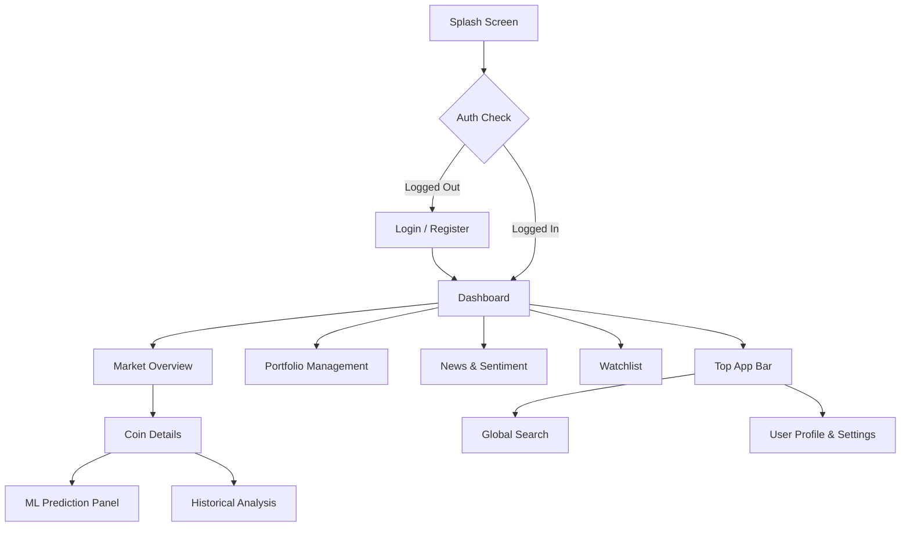

# 🎨 Complete Prototype & Design System: Crypto Market Intelligence

This document serves as the comprehensive UI/UX Design System and Prototype documentation for the Crypto Market Intelligence application, architected for a modern, high-end financial SaaS platform.

## 🖼️ 1. High-Fidelity UI Mockups

Here are AI-generated, high-fidelity mockups representing the exact visual direction of the application.

### Main Dashboard

### ML Prediction & Analysis Screen

---

## 🎨 2. Design System Specification

### Theme & Colors (Dark Mode Default)
*   **Background (Base):** `#0B0E14` (Deep Space Black)
*   **Surface (Cards/Modals):** `#151A22` with 40% opacity (Glassmorphism)
*   **Border / Divider:** `#2A3241` (Subtle dark blue/grey)
*   **Primary Accent:** `#00E5FF` (Neon Cyan - used for active states and primary charts)
*   **Secondary Accent:** `#7000FF` (Deep Purple - used for ML/AI related features)
*   **Positive (Gain):** `#00FFA3` (Mint Green)
*   **Negative (Loss):** `#FF3366` (Neon Pink/Red)
*   **Text Primary:** `#F8F9FA` (Off-white)
*   **Text Secondary:** `#8B95A5` (Cool Grey)

### Typography
*   **Font Family:** `Inter` (sans-serif) for clean, readable numbers and UI elements.
*   **Headings:** Semi-bold (600), `24px` - `32px`
*   **Body:** Regular (400), `14px` - `16px`
*   **Monospace (for addresses/hashes):** `JetBrains Mono`

### Structural Stylings
*   **Border Radius:** `16px` on major cards, `8px` on buttons and inputs.
*   **Glassmorphism:** CSS `backdrop-filter: blur(12px)` on all floating elements (modals, dropdowns, sticky navs).
*   **Shadows:** Subtle cyan/purple glowing box-shadows on hover states for primary buttons.

---

## 🧩 3. Component Library

| Component | State / Behavior | CSS Specifications (Tailwind approach) |
| :--- | :--- | :--- |
| **Primary Button** | Hover: Glow & slight scale | `bg-gradient-to-r from-cyan-500 to-blue-500 rounded-lg hover:shadow-[0_0_15px_rgba(0,229,255,0.5)] transition-all` |
| **Data Card** | Hover: Border highlight | `bg-[#151A22]/40 backdrop-blur-md rounded-2xl border border-[#2A3241] hover:border-cyan-500/50` |
| **Search Input** | Active: Cyan ring | `bg-[#0B0E14] text-white rounded-lg px-4 py-2 focus:ring-2 focus:ring-cyan-500 outline-none` |
| **Badge (Positive)** | Static | `bg-green-500/20 text-[#00FFA3] rounded-full px-2 py-1 text-xs` |
| **Badge (Negative)** | Static | `bg-red-500/20 text-[#FF3366] rounded-full px-2 py-1 text-xs` |
| **Toast Alert** | Slides in from top right | Glassmorphism base with left-border color indicating status (green/red/cyan). |

---

## 🗺️ 4. Navigation Flow & Information Architecture

---

## 📱 5. Responsive Layout Strategy

1.  **Desktop (>1024px):** 
    *   Fixed left sidebar (240px width). 
    *   Top app bar for global search and profile. 
    *   Main content area uses CSS Grid (e.g., 3-column layout for dashboard widgets).
2.  **Tablet (768px - 1024px):** 
    *   Sidebar collapses into a mini-rail (icons only, 80px width). 
    *   Grid reduces to 2 columns.
3.  **Mobile (<768px):** 
    *   Sidebar disappears, replaced by a bottom navigation bar. 
    *   Grid collapses into a single column (100% width stacked cards).
    *   Complex charts (like candlestick) become scrollable horizontally with a swipe indicator.

---

## 🛠️ 6. Implementation Stack Recommendations

To bring this design to life exactly as specified, the following stack is recommended for the frontend:
*   **Framework:** React 19 + Vite
*   **Styling:** Tailwind CSS (for rapid utility classes) + `clsx`/`tailwind-merge`
*   **Animations:** Framer Motion (for smooth layout transitions and loading states)
*   **Charts:** Lightweight Charts by TradingView (for professional candlesticks) and Recharts (for simple pies/lines)
*   **Icons:** Lucide React (clean, minimal line icons)
