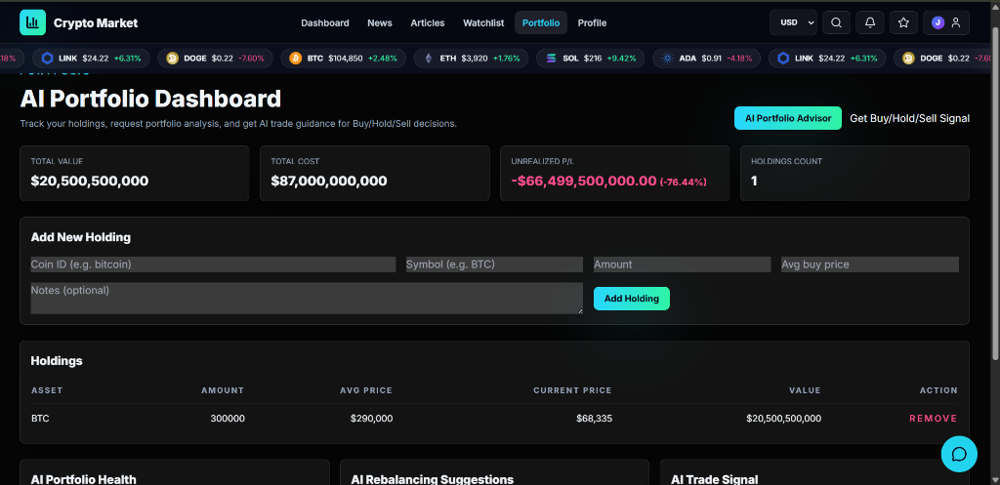
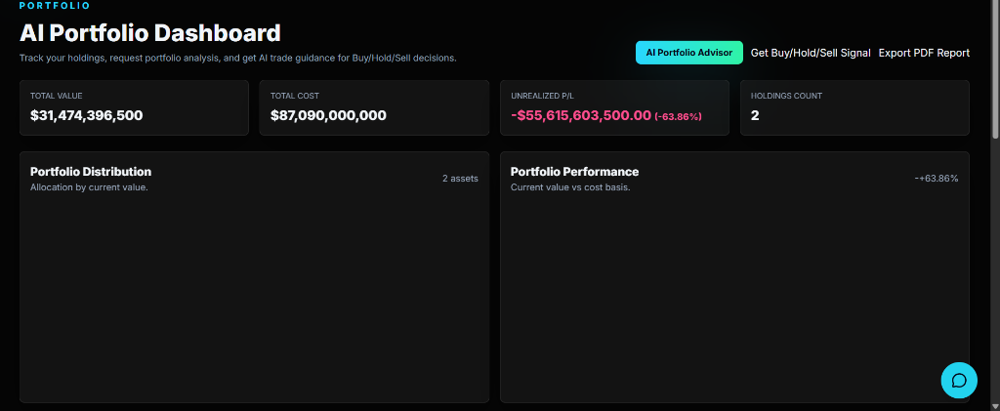
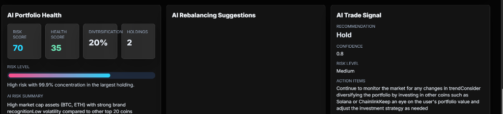
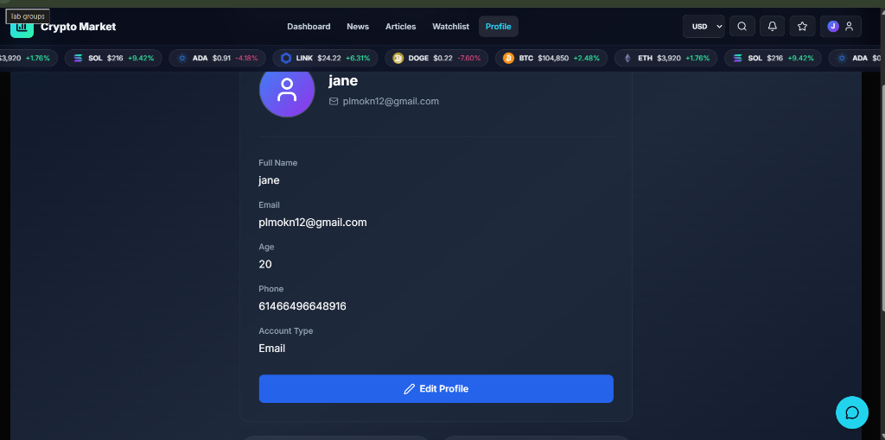
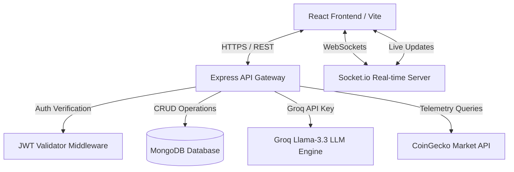

# 🪙 Crypto Market Intelligence Platform

[](#)
[](LICENSE)
[](#)
[](#)
[](#)
[](#)

An advanced, enterprise-grade AI-powered Cryptocurrency Analytics and Portfolio Management Platform. This platform integrates real-time market telemetry, custom portfolio tracking, and state-of-the-art Generative AI models to deliver actionable buy/hold/sell signals, rebalancing recommendations, and interactive portfolio breakdowns.

---

## 📸 Screenshots

### 💼 AI Portfolio Dashboard


### 📊 Portfolio Distribution & Performance Charts


### 🤖 AI Portfolio Health & Advisor Insights


### 👤 User Profile


---

## ✨ Features

*   **⚡ Real-Time Market Data**: Live prices, market cap, and volume powered by CoinGecko API with WebSocket telemetry.
*   **📊 Interactive Financial Charts**: Multi-timeframe price and volume trend analysis using custom Recharts.
*   **💼 Smart Portfolio Tracking**: Log holdings, cost bases, and unrealized profit/loss analytics in real-time.
*   **🤖 AI Financial Assistant**: Llama 3.3 model integrations using Groq API for chatbot discussions.
*   **⚖️ AI Rebalancing Suggestions**: Automatic analysis of asset concentration with rebalancing ratios.
*   **🚀 AI Trade Signals**: Instant generation of Buy/Hold/Sell signals with confidence percentages.
*   **📰 News & Articles Aggregator**: Curated news feeds with integrated AI-based market sentiment scanning.
*   **⭐ Real-Time Watchlist**: Synchronized, database-backed tracking of selected cryptocurrencies.
*   **🔒 Secure JWT Authentication**: Robust, cookie-backed token authentication with protected route access.
*   **📄 PDF Report Export**: Export detailed portfolio allocations and health reports via `html2canvas` and `jspdf`.
*   **📲 Progressive Web App (PWA)**: Support for offline caching and home screen installability.

---

## 🏗️ Architecture



---

## 🛠️ Tech Stack

| Layer | Technology | Purpose |
| :--- | :--- | :--- |
| **Frontend** | React (v19), Vite | User interface rendering and build toolchain |
| **Styling** | Tailwind CSS | Utility-first responsive components |
| **Animation** | Framer Motion | Fluid page transitions and micro-interactions |
| **Charts** | Recharts | Dynamic interactive price trends and distributions |
| **Backend** | Node.js, Express.js | Core web server framework |
| **Database** | MongoDB | Document database for watchlists, portfolios, users |
| **ORM** | Mongoose | Strict schema validation and database middleware |
| **AI Layer** | Groq SDK (Llama 3.3) | High-performance inference engine for portfolio advising |
| **Security** | Helmet, JWT, bcryptjs | Server hardening, protected sessions, secure hashing |
| **Real-time** | Socket.io | WebSocket server pushing real-time market pulses |

---

## ⚙️ Environment Variables

Create a `.env` file in the `/server` directory and populate it with the following configuration:

```ini
# Server Setup
PORT=8080
NODE_ENV=development

# Database Setup
MONGODB_URI=your_mongodb_connection_uri
MONGODB_DB_NAME=crypto_market

# Authentication Setup
JWT_SECRET=your_32_character_jwt_secret
JWT_EXPIRES_IN=7d

# Frontend Server
CLIENT_URL=http://localhost:5173

# AI Setup
GROQ_API_KEY=your_groq_api_key_here
GROQ_MODEL=llama-3.3-70b-versatile
```

---

## 🔌 API Endpoints

### 🔑 Authentication Routes
*   `POST /api/auth/register` - Create a new user account.
*   `POST /api/auth/login` - Authenticate a user and return a JWT.
*   `GET /api/auth/profile` - Retrieve the current authenticated user's profile.

### 🪙 Market Routes
*   `GET /api/market` - Fetch live price telemetry for top 80 coins.
*   `GET /api/markets` - Query paginated market listings with search/sort filters.
*   `GET /api/coins/:id` - Retrieve detailed information for a specific coin.
*   `GET /api/coins/:id/chart` - Retrieve price history for chart rendering.
*   `GET /api/global` - Retrieve global market statistics (dominance, fear & greed index).

### 💼 Portfolio Routes
*   `GET /api/portfolio` - Fetch the authenticated user's holdings.
*   `POST /api/portfolio/holdings` - Add a new asset holding.
*   `DELETE /api/portfolio/holdings/:id` - Remove a holding by ID.
*   `POST /api/portfolio/analyze` - Request AI-driven portfolio insights.
*   `POST /api/portfolio/signal` - Request AI Buy/Hold/Sell signals.

### ⭐ Watchlist Routes
*   `GET /api/watchlist` - Fetch the authenticated user's default watchlist.
*   `POST /api/watchlist/add` - Add an asset to the watchlist.
*   `DELETE /api/watchlist/remove/:coinId` - Remove an asset from the watchlist.

### 💬 Chatbot Routes
*   `POST /api/chat` - Send conversational prompt history to the AI agent.

---

## 📁 Project Structure

```
crypto-market/
│
├── src/                    # Frontend React Client
│   ├── assets/             # Images and styles
│   ├── components/         # Reusable UI (Charts, Cards, Navigation)
│   ├── context/            # React Contexts (Watchlist, Currency)
│   ├── data/               # Static dataset fallbacks
│   ├── hooks/              # Custom utility hooks (useAsync, useSocket)
│   ├── pages/              # Page Views (Dashboard, Portfolio, Auth)
│   ├── services/           # Axios-like API abstraction (api.js)
│   ├── utils/              # Client-side formatting helpers
│   ├── main.jsx            # React root mounting point
│   └── App.jsx             # React router structure
│
├── server/                 # Backend Node.js Server
│   ├── config/             # DB connection and env variables
│   ├── controllers/        # Route logic controllers
│   ├── middleware/         # Security, Rate limit, and Auth guards
│   ├── models/             # Mongoose DB Schemas
│   ├── routes/             # API Router mounts
│   ├── services/           # Groq and CoinGecko fetch services
│   ├── utils/              # Standardized API response utilities
│   ├── index.js            # Express server root
│   └── db.js               # Database adapter
│
├── package.json            # Client and backend script orchestration
└── vite.config.js          # Vite configuration and proxy routing
```

---

## 🤖 AI Financial Features

1.  **AI Chatbot**: Engages in standard conversation using live market contexts (e.g., current prices and fear & greed index) injected directly into the LLM system prompt.
2.  **AI Portfolio Advisor**: Evaluates the diversification, strengths, and weaknesses of your holdings, returning an overall health score, risk score, and recommended asset weights in clean, validated JSON.
3.  **AI Rebalancing Suggestions**: Provides actionable recommendations to restore ideal allocations and reduce concentration risks.
4.  **AI Trade Signals**: Produces strategic trade actions (Buy, Hold, Sell) for your current holdings based on technical levels and 24h market momentum.

---

## 🔒 Security Hardening

*   **🛡️ Headers & Protection**: Integrates `helmet` middleware to set HTTP security headers, protecting against clickjacking, cross-site scripting (XSS), and MIME sniffing.
*   **⏳ API Rate Limiting**: Employs `express-rate-limit` to restrict standard routes to 100 requests per minute and authentication routes to 15 attempts per 15 minutes per IP.
*   **🧼 Input Sanitization**: Standardizes user inputs and sanitizes external news content using `dompurify` to protect the DOM from script injections.
*   **🔐 Schema Safety**: Implements strict Mongo schema constraints with unique compound indexes to prevent race conditions or double collection creation.

---

## 🚀 Installation & Local Setup

### 1. Clone the Repository
```bash
git clone https://github.com/your-username/crypto-market-intelligence.git
cd crypto-market-intelligence
```

### 2. Install Project Dependencies
```bash
npm install
```

### 3. Setup Environment Variables
Configure your MongoDB database and Groq API key inside `/server/.env` following the [Environment Variables](#%EF%B8%8F-environment-variables) guide.

### 4. Run the Development Server
This runs Vite client and nodemon API server concurrently:
```bash
npm run dev
```
Open **`http://localhost:5173`** in your browser.

### 5. Build for Production
```bash
npm run build
```

---

## 📈 Performance Optimizations

*   **💾 Database Caching**: Connects queries for market insights to a TTL-indexed MongoDB caching table (`InsightsCache`) to avoid redundant CoinGecko queries.
*   **⚡ Parallel Fetching**: Speeds up frontend portfolio renders by loading market telemetry in parallel using `Promise.all` instead of sequential N+1 calls.
*   **📦 Bundle Splitting**: Employs tree-shaking and Rollup bundling to minimize production bundle sizes, splitting large library chunks (such as Framer Motion and Recharts).

---

## 🔮 Future Enhancements

*   **📊 Advanced Charting**: Integration of TradingView Advanced Charts for custom candlestick drawing.
*   **🔔 SMS Alert Triggers**: Automated Twilio notifications for target price breakouts.
*   **💼 Multi-currency Support**: Complete support for multi-asset staking and liquidity tracking metrics.
*   **🧑‍💻 Multi-auth**: Social login support (Google, GitHub, etc.) utilizing Passport.js.

---

## 🌎 Deployment Guide

### Deploying the Backend (Express & MongoDB)
*   **Render / Railway**: Create a new Web Service from your repository, select the node start command, and set the environment variables in the variables tab.

### Deploying the Frontend (React Client)
*   **Vercel / Netlify**: Connect the repository, set the root directory to project base, select **Vite** build preset, and input `VITE_API_BASE_URL` pointing to your deployed backend URL.

---

## 👤 Author

*   **Sanjay Kumar** — *Lead MERN Architect & Engineer* — [GitHub Profile](https://github.com/kumarsanjay60363)

---

## 📄 License

This project is licensed under the MIT License - see the [LICENSE](LICENSE) file for details.

---

## 🤝 Acknowledgements

*   **CoinGecko API** for providing comprehensive, live cryptocurrency data.
*   **Groq AI** for Llama 3.3 models powering the advisor panels.
*   **MongoDB Atlas** for secure, distributed cloud hosting.
*   **Tailwind CSS** & **Framer Motion** for visual layouts.
