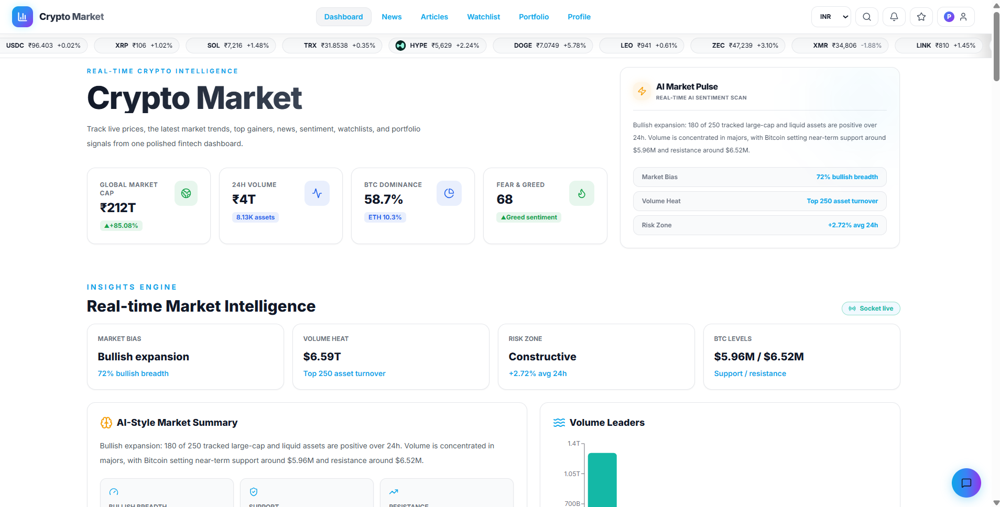
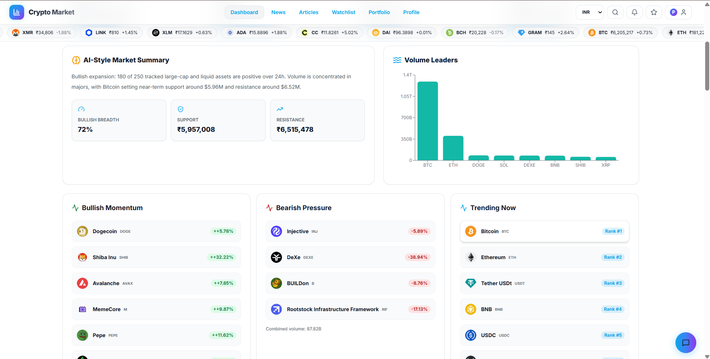
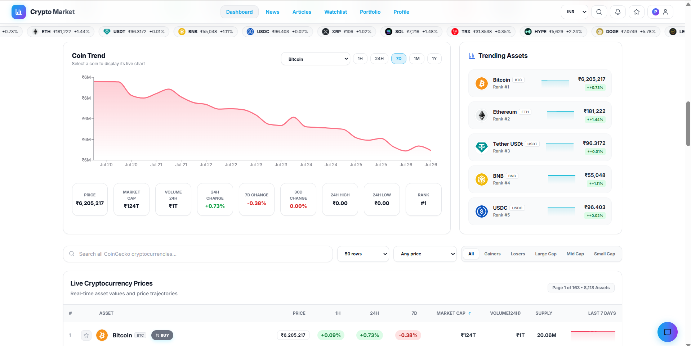
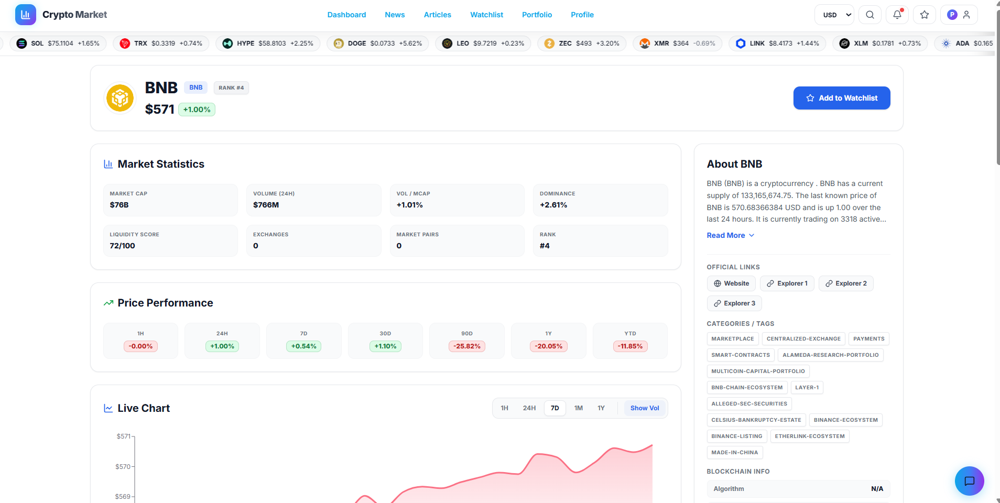
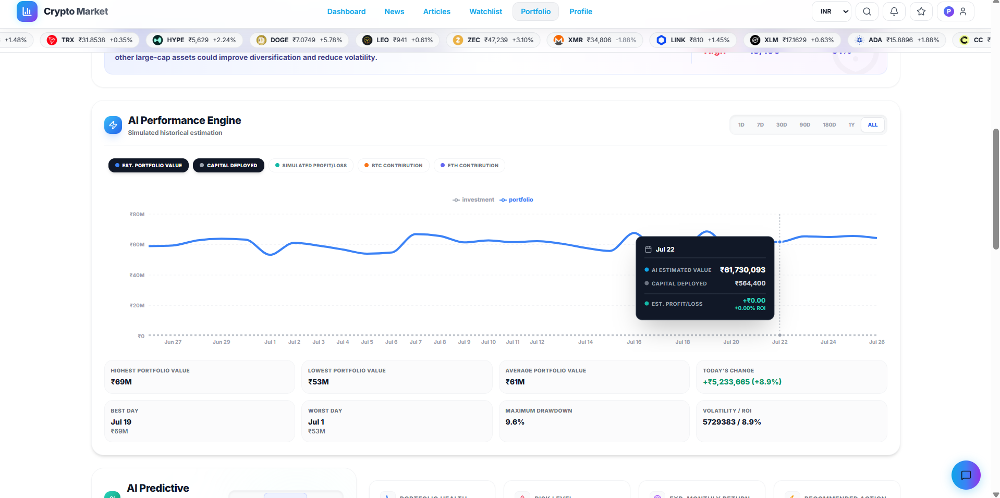
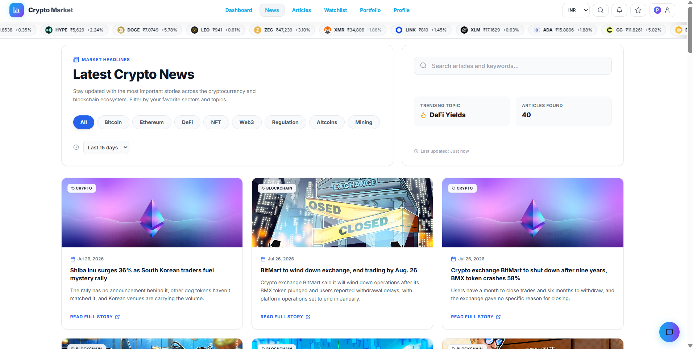
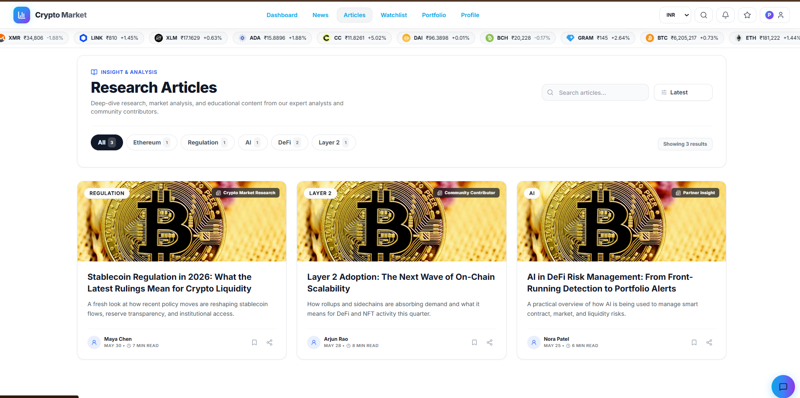
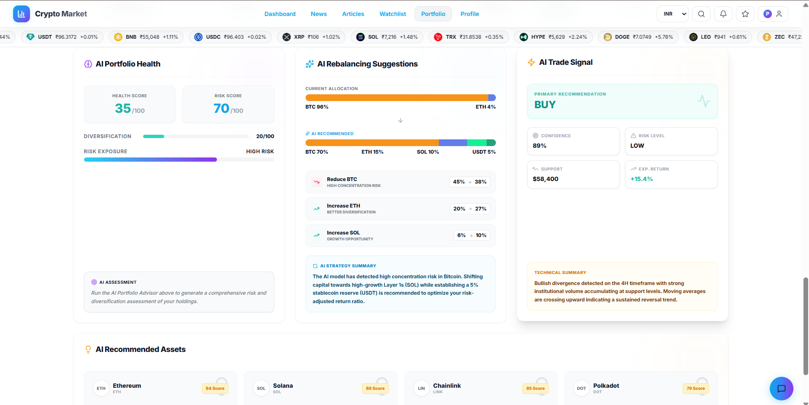
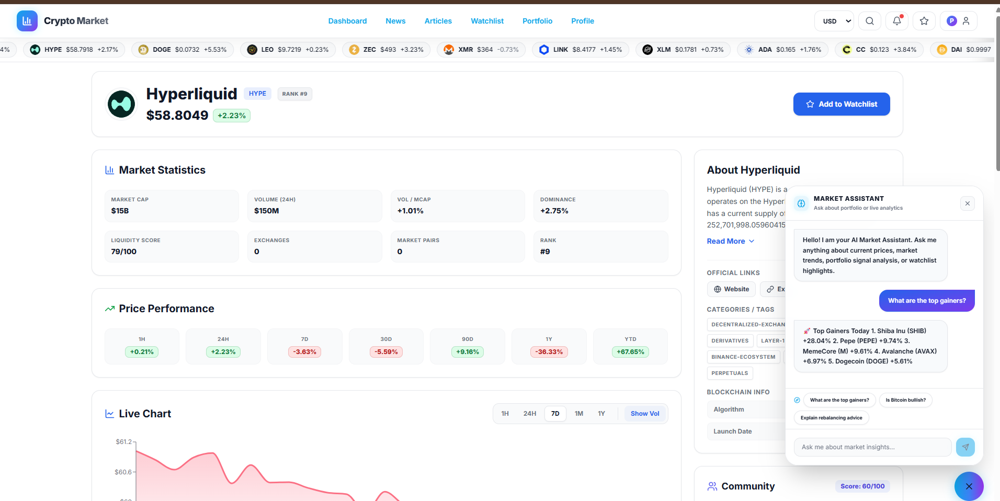
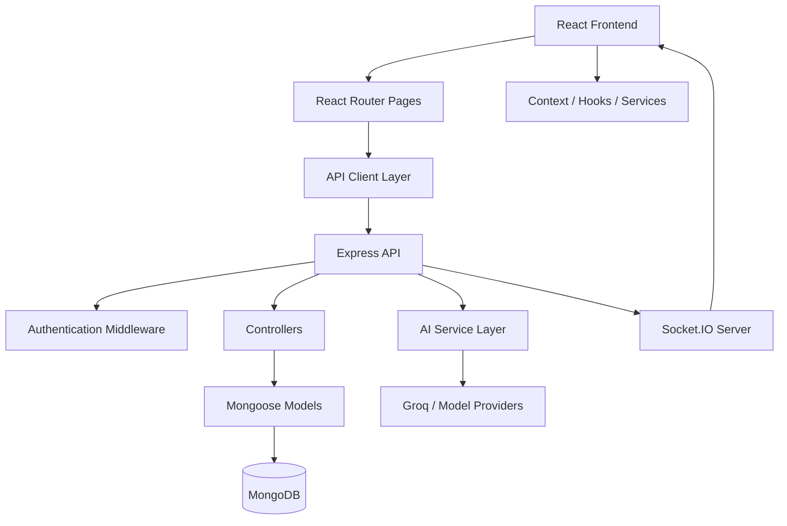

# 🪙 Crypto Market Intelligence Platform

> AI-Powered Cryptocurrency Market Analysis & Portfolio Management Platform

[](#)
[](#)
[](#)
[](#)
[](LICENSE)
[](#)
[](#)
[](#)
[](#)

Crypto Market Intelligence Platform is a full-stack, production-style cryptocurrency analytics and portfolio management application designed for modern investors, traders, and fintech teams. It combines real-time market data, advanced portfolio insights, AI-generated signals, and a polished user experience into a single cohesive product experience inspired by the best features of CoinMarketCap, CoinGecko, Binance, TradingView, and Delta Portfolio.

This repository serves as both a functional product and a reference implementation for building a scalable, modular, AI-enabled crypto web platform using the MERN stack and modern frontend tooling.

---

## Overview

The platform provides a complete investor workflow for monitoring digital assets, evaluating position performance, and making smarter decisions using intelligent automation. The experience begins with a live market dashboard, continues through asset detail pages and interactive charts, and expands into personalized portfolio planning and AI recommendations.

Built for performance and maintainability, the application emphasizes:

- Fast and responsive UI rendering with React and Vite
- Secure authentication and protected user routes
- Real-time market updates via Socket.IO
- AI-assisted portfolio analysis and explanation
- A modular backend suitable for expansion into SaaS features

### What this platform does

- Displays live market overviews for major cryptocurrencies
- Shows coin-level detail pages with rich charting and narrative data
- Allows users to create and manage watchlists
- Supports portfolio tracking with holdings, PnL, and allocation views
- Provides AI-generated portfolio health assessments and rebalancing hints
- Offers AI-powered chatbot interactions for market-oriented questions
- Supports PDF export and responsive, device-friendly dashboards

### Why it matters

In the digital asset landscape, users need more than raw price charts. They need an integrated interface that combines market intelligence, portfolio context, predictive guidance, and actionable recommendations. This project delivers that experience in one extensible codebase.

---

## Features

### Market

- Live cryptocurrency price tracking
- Market overview cards and summaries
- Searchable and filterable coin listings
- Market capitalization and volume insights
- Trending assets and price movement indicators

### Portfolio

- Portfolio creation and management
- Holding entry and transaction tracking
- Profit/loss reporting and allocation views
- Portfolio health monitoring
- Suggested rebalancing opportunities

### AI

- AI portfolio advisor
- AI allocation matrix
- AI performance engine
- AI trade signals
- AI predictive forecast
- AI recommended assets
- AI market assistant chatbot

### Authentication

- Secure registration and login
- JWT-based session handling
- Protected routes and role-aware access patterns
- User profile management

### Analytics

- Portfolio diversification analysis
- Hold concentration insights
- Historical trend comparison
- Market sentiment exploration
- Asset allocation breakdowns

### Performance

- Fast chart rendering with Recharts
- Smooth interactions through Framer Motion
- Responsive layouts and adaptive cards
- Efficient API orchestration and caching support

### Responsive UI

- Mobile-first responsive experience
- Adaptive dashboards for desktop and tablet users
- Component-driven layout and reusable UI primitives
- Modern visual design with Tailwind CSS

---

## Screenshots

The following sections are intended placeholders for screenshots and visual walkthroughs of the product experience.

### Dashboard

> Screenshots of the main market dashboard.





### Coin Details

> Placeholder: Add a screenshot of the coin detail page with charts and metadata.


(./screenshots/coin1.png)

### Portfolio

> Screenshots of the portfolio overview and health cards.





### News

> Screenshot of the market news and article feed.



### Articles

> Screenshot of article details and reading experience.



### AI Advisor

> Screenshot of the AI advisor and recommendation panels.





### Market Assistant

> Screenshot of the market assistant chatbot interface.



---

## Tech Stack

### Frontend

| Technology | Purpose |
| --- | --- |
| React | Component-based UI library |
| Vite | Fast development server and build tooling |
| Tailwind CSS | Utility-first styling system |
| React Router | Client-side route navigation |
| Recharts | Interactive chart visualizations |
| Axios | HTTP client for API interactions |
| Socket.IO Client | Real-time client connections |
| Framer Motion | Animation and motion design |

### Backend

| Technology | Purpose |
| --- | --- |
| Node.js | Runtime for the server-side application |
| Express.js | Web framework for API routing and middleware |
| JWT | Authentication token handling |
| Socket.IO | Real-time communication and subscriptions |
| Mongoose | MongoDB object modeling and validation |

### Database

| Technology | Purpose |
| --- | --- |
| MongoDB | Primary data store for users, portfolios, and watchlists |
| Mongoose | Schema-based data modeling and validation |

### APIs

| Service | Purpose |
| --- | --- |
| CoinGecko API | Market data, pricing, and token metadata |
| CoinMarketCap API | Market cap and pricing context |
| Crypto News API | Market news and article aggregation |
| Groq / LLM Services | AI reasoning, advisor outputs, and chat responses |

### Libraries

| Library | Purpose |
| --- | --- |
| DOMPurify | Sanitization of input and markup |
| html2canvas | Screenshot capture for reports |
| jsPDF | PDF export generation |
| bcryptjs | Password hashing |
| dotenv | Environment-variable loading |

---

## Installation

### Clone the repository

```bash
git clone https://github.com/Sanjaykumar7781/Crypto_Market_intelligence.git
cd crypto-market-intelligence
```

### Install frontend and backend dependencies

```bash
npm install
```

### Install additional tooling for local development


### Environment setup

Create a `.env` file at the project root or inside the server directory depending on your deployment layout. The application already supports loading environment variables from both locations.

### Run in development mode

```bash
npm run dev
```

This starts:

- the Vite frontend at `http://localhost:5173`
- the Express API server via nodemon

### Run the production build

```bash
npm run build
```

### Start the production server

```bash
npm run start
```

---

## Environment Variables

A representative `.env.example` file is shown below.

```env
# Server
PORT=8080
NODE_ENV=development
CLIENT_URL=http://localhost:5173

# Database
MONGODB_URI=mongodb://127.0.0.1:27017/crypto_market
MONGODB_DB_NAME=crypto_market
MONGODB_TIMEOUT_MS=8000

# Authentication
JWT_SECRET=replace_with_a_secure_32_character_secret
JWT_EXPIRES_IN=7d

# External APIs
COINGECKO_API_KEY=your_coingecko_api_key
COINMARKETCAP_API_KEY=your_coinmarketcap_api_key
NEWS_API_KEY=your_news_api_key

# AI Services
GROQ_API_KEY=your_groq_api_key
GROQ_MODEL=llama-3.3-70b-versatile

# Real-Time Socket
SOCKET_PORT=8080
SOCKET_MARKET_INTERVAL_MS=45000
```

### Variable reference

| Variable | Required | Description |
| --- | --- | --- |
| `PORT` | No | Port used by the backend server |
| `NODE_ENV` | No | Runtime environment (`development`, `production`) |
| `CLIENT_URL` | No | Frontend origin used for CORS and redirects |
| `MONGODB_URI` | Yes in production | MongoDB connection string |
| `JWT_SECRET` | Yes in production | Secret used to sign authentication tokens |
| `COINGECKO_API_KEY` | No | Optional market-data API access |
| `COINMARKETCAP_API_KEY` | No | Optional market-data API access |
| `NEWS_API_KEY` | No | Optional article/news provider access |
| `GROQ_API_KEY` | No | Enables AI-powered assistant features |
| `SOCKET_PORT` | No | Custom real-time socket server port |

---

## Available Scripts

The project includes a production-ready set of scripts for development, testing, and deployment.

| Script | Command | Description |
| --- | --- | --- |
| Development | `npm run dev` | Starts the frontend and backend together |
| Frontend Dev | `npm run dev:web` | Starts the Vite development server |
| Backend Dev | `npm run dev:api` | Starts the Express API server |
| Production Build | `npm run build` | Builds the frontend for production |
| Preview | `npm run preview` | Previews the production build locally |
| Start Server | `npm run start` | Starts the backend in production mode |
| Lint | `npm run lint` | Runs ESLint across the project |
| Lint | `npm run lint` | Runs ESLint across the project |
| Development | `npm run dev` | Starts the frontend and backend together |
| Production Build | `npm run build` | Builds the application for production |
| Preview | `npm run preview` | Starts a local preview of the production build |
| Start Server | `npm run start` | Runs the backend production server |

---

<<<<<<< HEAD
## Application Architecture

The application follows a layered architecture designed for maintainability and future scaling.


```mermaid
graph TD
    A[React Frontend] --> B[React Router Pages]
    A --> C[Context / Hooks / Services]
    B --> D[API Client Layer]
    D --> E[Express API]
    E --> F[Authentication Middleware]
    E --> G[Controllers]
    G --> H[Mongoose Models]
    H --> I[(MongoDB)]
    E --> J[AI Service Layer]
    J --> K[Groq / Model Providers]
    E --> L[Socket.IO Server]
    L --> A
```

### Frontend

The frontend is built with React and Vite and is organized around reusable UI components, page-level views, hooks, and shared services. It is responsible for rendering market data, portfolio visualizations, AI insights, and the overall user experience.

### Backend

The backend is built with Express.js and exposes RESTful API endpoints for authentication, market data, portfolio actions, watchlists, news, articles, and AI interactions. It also hosts Socket.IO services for real-time market updates.

### Database

MongoDB stores user profiles, portfolios, watchlists, AI history, and related metadata. The schema layer is implemented with Mongoose, enabling data validation and maintainability.

### APIs

The application integrates third-party services to provide market and news data. These integrations are encapsulated in server-side services so the frontend remains clean and stable.

### AI Layer

The AI layer uses LLM-powered services to interpret portfolio holdings, provide analysis, assign trade signals, and answer conversational questions. All AI responses are processed and validated before being surfaced to the user.

### Socket.IO

Socket.IO powers real-time data updates for market activity, helping the platform remain responsive and closer to live trading experiences.

---

## AI Features
=======
## 📄 License
>>>>>>> 3ccc9a1f1c98f44dfc91144df13cfd67d52ad28e

The AI experience is one of the platform’s core differentiators.

### AI Portfolio Advisor

This module reviews account holdings, diversification, concentration, and current market context to deliver a health assessment and recommendations for improving the portfolio.

### Allocation Matrix

The allocation matrix visualizes how assets are distributed across the portfolio and explains where risk concentration may exist. It helps users understand whether the current mix is balanced or overexposed.

### Performance Engine

The performance engine evaluates portfolio change over time and surfaces important trends, momentum signals, and stronger/underperforming areas.

### Trade Signals

This feature generates buy, hold, or sell guidance based on market conditions, recent trends, and portfolio context. Signals are framed as recommendations rather than guaranteed actions.

### Predictive Forecast

The forecast workflow attempts to synthesize recent performance, momentum, and market context to provide a short-horizon outlook for selected assets or the broader portfolio.

### Market Assistant

The assistant chatbot supports conversational questions with market context, portfolio awareness, and AI-generated guidance. It is designed to feel like a virtual analyst for everyday investors.

### Recommendation Engine

The recommendation engine proposes assets and portfolio adjustments based on risk appetite, diversification needs, and current market themes.

---

## API Documentation

The application exposes a structured backend API for frontend consumption and third-party integrations.

### Authentication

| Method | Endpoint | Purpose |
| --- | --- | --- |
| `POST` | `/api/auth/register` | Register a new user |
| `POST` | `/api/auth/login` | Authenticate and return a token |
| `GET` | `/api/auth/profile` | Retrieve the current authenticated user |

### Coins and Market Data

| Method | Endpoint | Purpose |
| --- | --- | --- |
| `GET` | `/api/coins` | List supported or market-visible assets |
| `GET` | `/api/coins/:id` | Retrieve a single coin’s data |
| `GET` | `/api/coins/:id/chart` | Retrieve chart history |
| `GET` | `/api/market` | Retrieve market summaries |
| `GET` | `/api/global` | Retrieve global market metrics |

### Portfolio

| Method | Endpoint | Purpose |
| --- | --- | --- |
| `GET` | `/api/portfolio` | Fetch current portfolio data |
| `POST` | `/api/portfolio/holdings` | Add or update a holding |
| `DELETE` | `/api/portfolio/holdings/:id` | Remove a holding |
| `POST` | `/api/portfolio/analyze` | Request AI portfolio analysis |
| `POST` | `/api/portfolio/signal` | Request AI trade signals |

### Watchlist

| Method | Endpoint | Purpose |
| --- | --- | --- |
| `GET` | `/api/watchlist` | Fetch the current watchlist |
| `POST` | `/api/watchlist/add` | Add a coin to the watchlist |
| `DELETE` | `/api/watchlist/remove/:coinId` | Remove a coin from the watchlist |

### News and Articles

| Method | Endpoint | Purpose |
| --- | --- | --- |
| `GET` | `/api/news` | Retrieve news stories |
| `GET` | `/api/articles` | Retrieve article content |
| `GET` | `/api/articles/:id` | Retrieve a single article |

### AI and Chat

| Method | Endpoint | Purpose |
| --- | --- | --- |
| `POST` | `/api/ai/advice` | Request AI-generated portfolio guidance |
| `POST` | `/api/chat` | Send a conversation prompt to the assistant |
| `GET` | `/api/chat/history` | Retrieve recent assistant history |

---

## Quality and Maintenance

The project is maintained with linting and build validation rather than automated test suites.

- ESLint is used to catch code quality issues
- The production build is used as the primary validation step
- Manual QA and runtime validation are recommended during feature work

---

## Deployment

### Frontend deployment

The frontend is designed to deploy to Vercel, Netlify, or any static hosting platform that supports Vite builds.

Recommended build command:

```bash
npm run build
```

### Backend deployment

The backend can be deployed to Render, Railway, Fly.io, or a Node.js-compatible host. Ensure environment variables are configured securely in the deployment environment.

### MongoDB Atlas

For production,

- create a MongoDB Atlas cluster
- configure network access
- store the connection URI in `MONGODB_URI`
- enable authentication and access controls

### Environment variables for deployment

Use the deployment platform’s secret manager or environment variable interface and include:

- `MONGODB_URI`
- `JWT_SECRET`
- `CLIENT_URL`
- `GROQ_API_KEY`
- `COINGECKO_API_KEY`
- `COINMARKETCAP_API_KEY`
- `NEWS_API_KEY`

---

## Performance Optimizations

The product is designed with production concerns in mind.

- Lazy loading for larger UI sections
- Memoization for chart and list rendering where appropriate
- Caching for repeated API responses and market lookups
- Pagination for long lists and search results
- Code splitting and bundle optimization via Vite and Rollup
- Responsive image and component loading strategies

---

## Security

Security is treated as a first-class concern in the platform design.

- JWT-based authentication for secure sessions
- Protected routes for private user resources
- Input validation on incoming requests
- Rate limiting for sensitive endpoints
- Output sanitization for user-generated or third-party content
- Environment-based secrets handling for production deployments

---

## Future Enhancements

The current platform is a strong foundation for a much larger SaaS experience. The next wave of enhancements could include:

1. Advanced TradingView-style charting panels
2. Portfolio tax optimization and capital gains analysis
3. Multi-wallet and exchange integration
4. Social trading and copy-trading features
5. Real-time alerts and push notifications
6. Mobile-native apps for iOS and Android
7. Dark/light theme personalization
8. AI-generated portfolio scenarios and simulations
9. Multi-language support and localization
10. Enhanced paper trading mode
11. Institutional dashboard views and analytics packs
12. Advanced risk metrics and stress testing
13. Integrated staking and DeFi position tracking
14. Webhook-based event notifications
15. Smart watchlist alert automation
16. AI-based sentiment scoring across social media sources
17. Customizable dashboards and widget layout
18. Advanced export options including CSV and Excel
19. Team collaboration and shared portfolios
20. White-label enterprise deployment capabilities
21. Premium subscription and billing integration
22. Governance and voting insight modules
23. On-chain analytics and wallet health metrics
24. Network activity and blockchain explorer integrations
25. Support for additional exchanges and market venues
26. Historical scenario replay and backtesting tools
27. AI-driven asset clustering and thematic investing
28. Voice-based market assistance
29. Cross-chain portfolio aggregation
30. Enterprise reporting features for advisors and funds

---

## Contributing

Contributions are welcome and encouraged.

### Contribution workflow

1. Fork the repository
2. Create a feature branch
3. Make your changes with clear commit messages
4. Add or update tests when relevant
5. Open a pull request with a concise summary and rationale

### Guidelines

- Follow existing code style and conventions
- Keep changes focused and easy to review
- Document new features or configuration changes
- Ensure the relevant tests pass before opening a PR
- Avoid introducing unnecessary dependencies

### Pull request checklist

- [ ] Code compiles locally
- [ ] Tests are added or updated as needed
- [ ] Documentation is updated when behavior changes
- [ ] No secrets or private credentials are committed
- [ ] The change is scoped and clearly described

---

## License

This project is distributed under the MIT License.

You may use, modify, and distribute this software in accordance with the MIT License terms. A LICENSE file should be added before publishing the repository publicly.

---

## Author

### Sanjay Kumar

Lead Engineer and Architect of the Crypto Market Intelligence Platform.

- Role: Full-stack engineer, systems architect, and product-minded developer
- Focus: React, Node.js, AI integrations, cloud-ready architecture, and modern web platform design
- Interests: Fintech, analytics, developer tooling, and scalable product systems

---

## Acknowledgements

This project draws inspiration from the best-in-class user experiences of:

- CoinMarketCap
- CoinGecko
- TradingView
- Binance
- Delta Portfolio

Special thanks to the broader open-source and developer community for the libraries, patterns, and tooling that make modern web applications possible.

---

## Project Summary

Crypto Market Intelligence Platform is more than a crypto dashboard. It is a complete digital asset intelligence experience aimed at helping users understand the market, manage their portfolio, and make better short- and long-term decisions with the help of AI.

From real-time market visibility to AI-backed recommendations, the project is designed to be modular, extensible, and production-friendly. Whether you are using it as a personal crypto tracker or as the foundation for a larger financial SaaS product, the architecture and documentation are intended to support growth.

---

## Quick Start Checklist

If you want to get started quickly, follow this streamlined sequence:

1. Clone the repository
2. Install dependencies with `npm install`
3. Create your `.env` file with the required variables
4. Start the application with `npm run dev`
5. Open the frontend in your browser
6. Explore the dashboard, portfolio, and AI features
7. Use the build and lint commands to validate the application locally

---

## Development Notes

- The project uses a modular structure that separates user-facing UI, server-side controllers, services, and models.
- The backend is designed to remain extensible for future features such as exchange integrations, alerting, and deeper analytics.
- The frontend is intentionally componentized to make it easier to evolve into a larger dashboard product over time.

---

## Support and Feedback

If you have questions, suggestions, or improvement ideas, please open an issue or begin a discussion in the repository. Feedback on architecture, API design, and product direction is always welcome.
